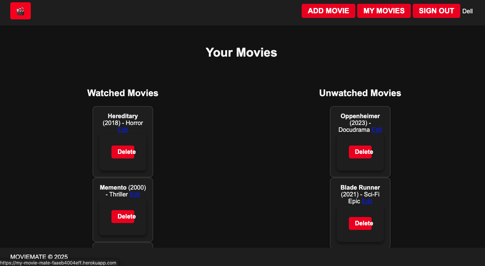

# MovieMate

## Description
**MovieMate** is a dynamic CRUD application designed to help movie enthusiasts organize their movie-watching experience. With MovieMate, users can create, view, update, and delete entries from their personalized movie watchlist. This app allows users to track movies they've seen, plan future viewings, and manage their collections efficiently. Its user-friendly interface ensures a seamless experience while maintaining a stylish and modern design.

 

## Getting Started
Experience MovieMate: [MovieMate] (https://my-movie-mate-faaeb4004eff.herokuapp.com/)

## Technologies Used
* **HTML** for structuring the web application.
* **CSS** for styling and responsive design.
* **JavaScript** (with Node.js and Express) for backend logic and interactivity.
* **MongoDB** for database storage of movie data.

## Getting Started

## Next Steps

* Style the Edit Button: Improve the visual styling of the "Edit" button to make it consistent with the overall design of the app and visually distinct.

* Enhance Movie Info Layout: Reorganize the movie information within each card to improve readability and visual appeal. For example, use distinct sections for the title, year, genre, and description.

* Search Functionality: Add a search bar to allow users to quickly locate movies in their watchlist.

* Filter Options: Enable users to filter movies by genre, release year, or watched/unwatched status.

* Sorting Feature: Allow users to sort their movie lists alphabetically, by release year, or by genre.

* User Authentication: Implement user accounts to allow multiple users to maintain their personalized watchlists.

* Mobile Optimization: Enhance the app's mobile responsiveness to ensure a seamless experience on smaller devices.

* Add Movie Ratings: Allow users to rate and review their watched movies.

* Movie Recommendations: Use APIs to suggest movies based on the user's watchlist or preferences.

* Dark Mode Toggle: Add a dark mode option to improve usability in low-light environments.

